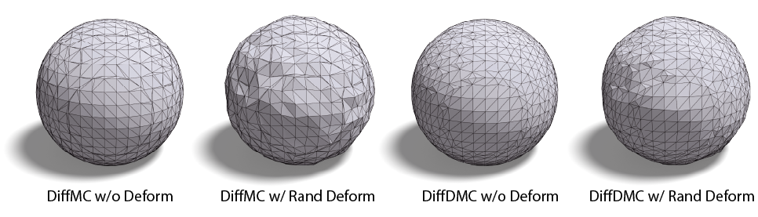
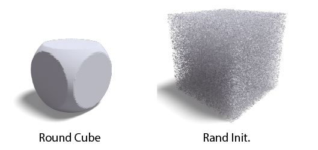

# Differentiable Iso-Surface Extraction Package (DISO)
This repository consists of a variety of differentiable iso-surface extraction algorithms implemented in `cuda`.

Currently, two algorithms are incorporated:
* Differentiable **Marching Cubes** [1] (DiffMC)
* Differentiable **Dual Marching Cubes** [2] (DiffDMC)

The differentiable iso-surface algorithms have multiple applications in gradient-based optimization, such as shape, texture, materials reconstruction from images.

# Installation
Requirements: torch (must be compatible with CUDA version), trimesh
```
pip install diso
```

# Quick Start
You can effortlessly try the following command, which converts a sphere SDF into triangle mesh using different algorithms. The generated results are saved in `out/`.
```
python test/example.py
```

Note:
* `DiffMC` generates guaranteed watertight manifold meshes w/ or w/o grid deformation.
* `DiffDMC` generates watertight manifold meshes when grid deformation is disabled. When enabling grid deformation, self-intersection may occur, but the face connectivity remains manifold.
* `DiffDMC` can produce a more uniform triangle distribution and smoother surfaces than `DiffMC` and supports generating quad meshes (in the example, the quad is automatically divided into two triangles by `trimesh`).

<p align="center">
  
</p>

# Usage
All the functions share the same interfaces. Firstly you should build an iso-surface extractor as follows:
```
from diso import DiffMC
from diso import DiffDMC

diffmc = DiffMC(dtype=torch.float32).cuda() # or dtype=torch.float64
diffdmc = DiffDMC(dtype=torch.float32).cuda() # or dtype=torch.float64
```
Then use its `forward` function to generate a single mesh:
```
verts, faces = diffmc(sdf, deform)  # or deform=None
verts, faces = diffdmc(sdf, deform)  # or deform=None
```

Input
* `sdf`: queries SDF values on the grid vertices (see the `test.py` for how to create the grid). The gradient will be back-propagated to the source that generates the SDF values. (**[N, N, N, 3]**)
* `deform (optional)`: (learnable) deformation values on the grid vertices, the range must be [-0.5, 0.5], default=None.  (**[N, N, N, 3]**)

Output
* `verts`: mesh vertices within the range of [0, 1]. (**[V, 3]**)
* `faces`: mesh face indices (starting from 0). (**[F, 3]**). Note `DiffMC` can return quads with `return_quads` set as True.

The gradient will be automatically computed when `backward` function is called.

# Speed Comparison
We compare our library with DMTet [3] and FlexiCubes [4] on two examples: a simple round cube and a random initialized signed distance function.

<p align="center">
  
</p>

The algorithms have been rigorously tested on an NVIDIA RTX 4090 GPU. Each algorithm underwent 100 repeated runs, and the table presents the time and CUDA memory consumption for **a single run**.

| Round Cube | DMTet | FlexiCubes | DiffMC | DiffDMC |
| --- | --- | --- | --- | --- |
| \# Vertices | 19622 | 19424 | 19944 | 19946 |
| \# Faces | 39240 | 38844 | 39884 | 39888 |
| VRAM / G | 1.57 | 5.40 | 0.60 | 0.60 |
| Time / ms | 9.61 | 10.00 | 1.54 | 1.44 |


| Rand Init. | DMTet | FlexiCubes | DiffMC | DiffDMC |
| --- | --- | --- | --- | --- |
| \# Vertices | 2597474 | 2785274 | 2651046 | 2713134 |
| \# Faces | 4774241 | 4364842 | 4717384 | 4431380 |
| VRAM / G | 3.07 | 4.07 | 0.59 | 0.45 |
| Time / ms | 49.10 | 65.35 | 2.55 | 2.78 |


# Citation
If you find this repository useful, please cite the following paper:
```
@article{wei2023neumanifold,
  title={NeuManifold: Neural Watertight Manifold Reconstruction with Efficient and High-Quality Rendering Support},
  author={Wei, Xinyue and Xiang, Fanbo and Bi, Sai and Chen, Anpei and Sunkavalli, Kalyan and Xu, Zexiang and Su, Hao},
  journal={arXiv preprint arXiv:2305.17134},
  year={2023}
}
```

# Reference
[1] We L S. Marching cubes: A high resolution 3d surface construction algorithm[J]. Comput Graph, 1987, 21: 163-169.

[2] Nielson G M. Dual marching cubes[C]//IEEE visualization 2004. IEEE, 2004: 489-496.

[3] Shen T, Gao J, Yin K, et al. Deep marching tetrahedra: a hybrid representation for high-resolution 3d shape synthesis[J]. Advances in Neural Information Processing Systems, 2021, 34: 6087-6101.

[4] Shen T, Munkberg J, Hasselgren J, et al. Flexible isosurface extraction for gradient-based mesh optimization[J]. ACM Transactions on Graphics (TOG), 2023, 42(4): 1-16.